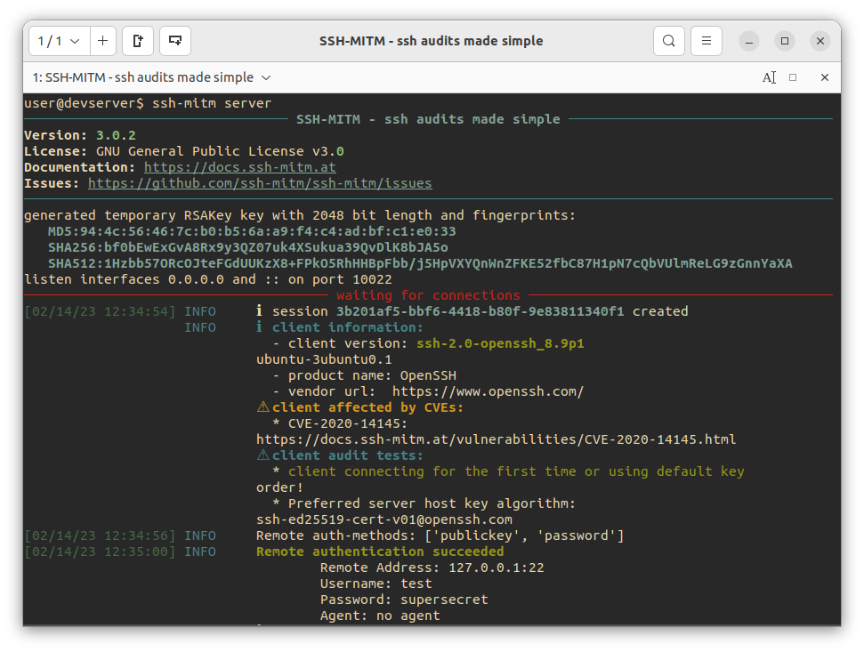
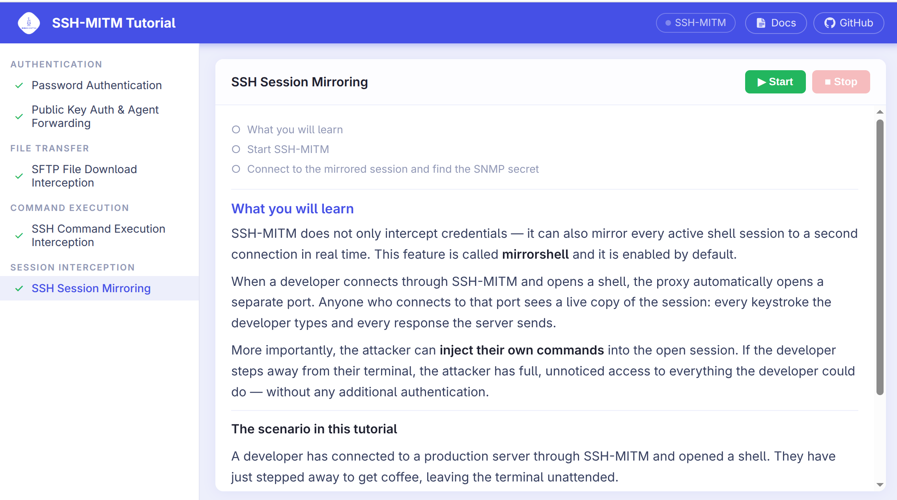

:fas:`rocket` Get Started
=========================

SSH-MITM acts as a proxy between an SSH client and its server.
Placed on the network path, it terminates both connections independently
and forwards all traffic — giving the auditor full visibility while the
session continues normally from the user's perspective.

.. image:: ../_static/ssh-mitm-setup.svg
    :class: dark-light
    :alt: SSH-MITM proxy setup diagram

.. important::

    **SSH is not broken.**  SSH-MITM can only intercept a session if the
    client accepted SSH-MITM's host key — either by trusting it for the
    first time, or because fingerprint verification was skipped.

    When you connect a client to SSH-MITM for the first time, SSH will
    display a fingerprint prompt.  Accepting it is what enables the
    interception.  In a real attack scenario, this is the moment a careful
    user would detect that something is wrong.

    See :doc:`/user_guide/fingerprint` for a full explanation of the
    fingerprint mechanism and when users accept it anyway.

Install
-------

.. tab-set::

    .. tab-item:: AppImage

        No installation required — download and run:

        .. code-block:: none

            $ wget https://github.com/ssh-mitm/ssh-mitm/releases/latest/download/ssh-mitm-x86_64.AppImage
            $ chmod +x ssh-mitm-x86_64.AppImage

        In all commands below, replace ``ssh-mitm`` with ``./ssh-mitm-x86_64.AppImage``.

    .. tab-item:: Snap

        .. code-block:: none

            $ sudo snap install ssh-mitm

    .. tab-item:: Flatpak

        .. code-block:: none

            $ flatpak install flathub at.ssh_mitm.server

    .. tab-item:: pip

        .. code-block:: none

            $ pip install ssh-mitm

For a full list of installation options see :doc:`/develop/installation`.

Start SSH-MITM
--------------

Point SSH-MITM at the target host — use a system you are authorized to test:

.. code-block:: none

    $ ssh-mitm server --remote-host <target-host>

Route a client connection
--------------------------

Have the SSH client connect through SSH-MITM on port 10022:

.. code-block:: none

    $ ssh -p 10022 user@<mitm-host>

SSH will display a host key fingerprint prompt — accept it to continue.
See :doc:`/user_guide/fingerprint` for a full explanation of the
fingerprint mechanism and why it matters.

SSH-MITM intercepts the session and logs the credentials immediately:

.. code-block:: none
    :class: no-copybutton

    INFO     Client connection established with parameters:
                 Remote Address: <target-host>:22
                 Username:       mmorgan
                 Password:       secret
                 Agent:          no agent

Attach to the live session
---------------------------

For every intercepted connection, SSH-MITM opens a mirrorshell on a
local port:

.. code-block:: none
    :class: no-copybutton

    INFO     ℹ created mirrorshell on port 34463. connect with: ssh -p 34463 127.0.0.1

Connect to it from a second terminal — no password required:

.. code-block:: none

    $ ssh -p 34463 127.0.0.1

The mirror shell reflects the session in real time. Commands typed in
either window appear in both. The auditor can also inject commands
independently, without the user noticing.

Interactive tutorial
--------------------

No target server available? The interactive tutorial simulates all
scenarios using a built-in mock SSH server:

.. code-block:: none

    $ ssh-mitm tutorial

The tutorial runs across two windows. In the **terminal**, SSH-MITM logs
what it captures from each simulated session. In the **browser**, each
chapter describes the scenario and asks you to locate the intercepted
value in the proxy output.

All chapters are set during an authorized assessment of **Logfile Inc.**

.. toctree::
   :hidden:

   scenario

.. card::
   :class-card: sd-shadow-md sd-border-2 sd-border-primary
   :class-header: sd-bg-primary sd-text-white

   :fas:`building` About the Assessment — Logfile Inc.
   ^^^^^^^^^^^^^^^^^^^^^^^^^^^^^^^^^^^^^^^^^^^^^^^^^^^^^

   Before starting, read about the company, the staff members you will
   encounter, and the internal infrastructure that connects them.
   Every chapter builds on the same story.

   :doc:`→ The Logfile Inc. Assessment <scenario>`

.. card:: Prologue — Host Key Verification

   Max Morgan connects to the web server for the first time. SSH-MITM
   inserts itself in the connection, Max accepts its host key without
   checking the fingerprint, and a second connection reveals his
   fingerprint state through CVE-2020-14145 — before any credential
   is entered.

   :doc:`→ SSH Fingerprints </user_guide/fingerprint>`

.. card:: Chapter 1 — Password Authentication

   Max connects to the web server using password authentication.
   SSH-MITM logs the username and password in cleartext.
   The proxied session continues normally on the remote server.

   :doc:`→ Authentication </user_guide/authentication>`

.. card:: Chapter 2 — Public Key Auth & Agent Forwarding

   Sarah King switches to key-based authentication with agent forwarding.
   SSH-MITM records the accepted public key fingerprint. The forwarded
   agent is accessible through the proxy and can authenticate to further
   systems as Sarah.

   :doc:`→ SSH Agent </user_guide/sshagent>`

.. card:: Chapter 3 — SFTP File Download

   Max downloads a file from the internal file server via SFTP.
   SSH-MITM logs every SFTP operation, including the file path and
   the transferred content.

   :doc:`→ File transfers </user_guide/file_transfer>`

.. card:: Chapter 4 — SSH Command Execution

   Max's automated deployment script runs a non-interactive command
   on the web server via SSH exec. SSH-MITM captures the exact command
   string and the server response.

   :doc:`→ Session interception </user_guide/sessions>`

.. card:: Chapter 5 — Session Mirroring

   Thomas Webb opens an SSH session to the core router and leaves the
   terminal unattended. SSH-MITM exposes the session via a local
   mirrorshell port. An auditor attaches to the port and reads the
   device configuration while the original session remains active.

   :doc:`→ Session interception </user_guide/sessions>`

.. card:: Chapter 6 — SSH Key Enumeration

   An intercepted git clone reveals an internal Git platform —
   LogfileGit. User profiles list registered SSH public keys — the
   same keys developers use to log in to servers. ``check-publickey``
   queries the SSH user validity oracle (CVE-2016-20012) for each key,
   mapping mmorgan's lateral movement paths across the infrastructure.

   :doc:`→ Authentication </user_guide/authentication>`

.. card:: To be continued...

   The Logfile Inc. assessment is ongoing. More chapters are in
   development — covering additional techniques and scenarios encountered
   during the engagement.

   :doc:`→ Audit Guide </user_guide/index>`

Go deeper
---------

The :doc:`Audit Guide </user_guide/index>` covers all interception
techniques in depth — authentication, file transfers, port forwarding,
protocol-specific interception, and client auditing.
