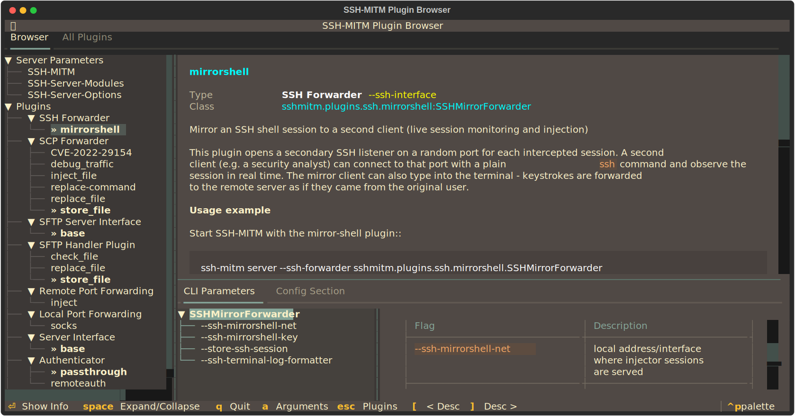

:fas:`puzzle-piece` Plugin Browser
===================================

The Plugin Browser is an interactive terminal UI for exploring all available SSH-MITM plugins,
their configuration options, and current values — without modifying any files.
It is a read-only reference tool designed to help understand the plugin system before writing
or adjusting a configuration file.

Starting the Plugin Browser
----------------------------

Launch the Plugin Browser with:

.. code-block:: none

    $ ssh-mitm plugins show

To also display the values from your own configuration file alongside the defaults, pass it via
``--config``:

.. code-block:: none

    $ ssh-mitm plugins show --config myconfig.ini

When a configuration file is provided, the Plugin Browser adds an extra column in the
*Config Section* tab that shows the values from that file next to the built-in defaults —
making it easy to compare your settings against the baseline.

Interface Overview
------------------

The Plugin Browser has two tabs accessible at the top of the screen.

Browser Tab
~~~~~~~~~~~

The *Browser* tab is the main view. It is split into a tree on the left and a detail panel on
the right.

**Left — Plugin Tree**

The tree has two top-level sections:

- **Server Parameters** — global configuration groups that apply to the SSH-MITM server itself,
  independent of any specific plugin (e.g. listen address, log format, host key settings).
- **Plugins** — all plugin types supported by SSH-MITM, each with the list of available
  implementations registered as entry points. The currently active implementation for each
  plugin type is highlighted with a ``»`` marker.

Selecting any entry in the tree updates the detail panel on the right.

**Right — Detail Panel**

The detail panel shows information about the selected tree node and contains two tabs:

*CLI Parameters*

Lists all command-line arguments accepted by the selected plugin or parameter group.
A secondary tree on the left of this tab lets you navigate between argument groups.
Selecting an individual flag shows a detailed view with:

- the flag name(s) and a description
- the data type and whether the argument is required
- the default value as defined in the code
- the corresponding INI config key and section
- the current value in ``default.ini``
- the value in the user-supplied config file (if ``--config`` was passed)

*Config Section*

Displays all configuration keys for the selected plugin or group in a table.
The columns are:

- **Key** — the config key name
- **Type** — the expected data type (``str``, ``bool``, ``int``, …)
- **Default** — the default value from the source code
- **default.ini** — the value from the built-in default configuration
- *<your config file>* — the value from the file passed via ``--config`` (only shown if provided)

Keys that exist in the user config but have no corresponding CLI argument are marked with a
warning symbol.

All Plugins Tab
~~~~~~~~~~~~~~~

The *All Plugins* tab shows a flat table of every registered plugin across all categories.
The columns are:

- **Category** — the plugin type (e.g. *SSH Interface*, *SCP Interface*)
- **EP-Name** — the entry-point name used in the configuration file
- **Active** — indicates whether this plugin is currently selected in the loaded config
- **Class** — the fully qualified Python class name (``module:ClassName``)
- **Description** — the first line of the plugin's docstring

The table can be filtered in two ways:

- **Status filter** — show *All*, only *Active*, or only *Inactive* plugins
- **Text search** — filters across category, entry-point name, class, and description simultaneously

Keyboard Shortcuts
------------------

.. list-table::
   :header-rows: 1
   :widths: 20 80

   * - Key
     - Action
   * - :kbd:`q`
     - Quit the Plugin Browser
   * - :kbd:`a`
     - Move focus to the Arguments panel in the detail view
   * - :kbd:`Escape`
     - Move focus back to the Plugin Tree
   * - :kbd:`[`
     - Shrink the description section in the detail panel
   * - :kbd:`]`
     - Grow the description section in the detail panel
