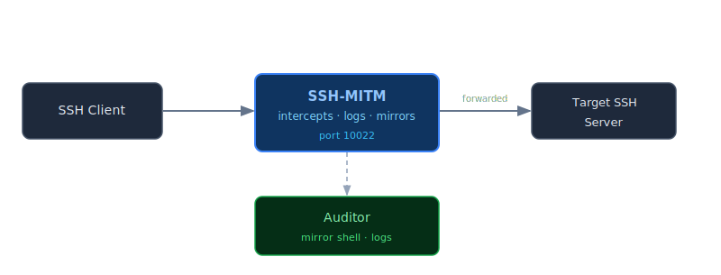
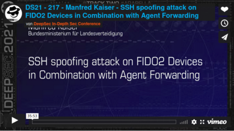

=================================
SSH-MITM - ssh audits made simple
=================================

.. div:: sd-fs-5 sd-font-weight-bold

   SSH-MITM is an open-source man-in-the-middle SSH server for security audits and malware analysis.
   Placed on the network path between client and server, it intercepts SSH sessions in real time
   through a flexible plugin system.

.. admonition:: :fas:`scale-balanced` Legal Notice
   :class: legal-notice

   SSH-MITM is intended for authorized security audits, penetration testing, and research only.
   Do not use it against systems you do not own or have explicit written permission to test.
   Unauthorized interception of SSH traffic may be illegal in your jurisdiction.
   See the :doc:`Legal Notice </user_guide/legal>` for details.

.. grid:: 1 1 2 2
   :gutter: 3

   .. grid-item-card:: :fas:`rocket` Get Started
      :link: get_started/index
      :link-type: doc

      New to SSH-MITM? The interactive tutorial walks through five
      real interception scenarios — no target server needed.
      Up and running in under two minutes.

   .. grid-item-card:: :fas:`book` Audit Guide
      :link: user_guide/index
      :link-type: doc

      All interception techniques in depth — authentication, file
      transfers, port forwarding, NETCONF, PowerShell, and client
      auditing.

Features
========

SSH-MITM acts as a proxy between SSH client and server — it terminates both
connections independently and forwards all traffic. This gives the auditor
full visibility into the session without disrupting it.

.. list-table::
   :widths: 1 99
   :class: feature-list

   * - :fas:`key`
     - Intercept **passwords and public keys** — including fallback from key to password auth
   * - :fas:`terminal`
     - **Mirror live sessions** and inject commands via mirrorshell
   * - :fas:`file-arrow-up`
     - Capture or replace **SCP and SFTP file transfers**
   * - :fas:`network-wired`
     - Intercept **TCP tunnels** and SOCKS dynamic forwarding
   * - :fas:`shield-halved`
     - Detect and demonstrate **FIDO2 token phishing** (trivial authentication attack)
   * - :fas:`magnifying-glass`
     - Audit **SSH client behavior** — version fingerprinting, key negotiation, CVE matching
   * - :fab:`windows`
     - Intercept **PowerShell Remoting (PSRP)** and **NETCONF** sessions

Security Research
=================

Operating from the Man-in-the-Middle position makes it possible to observe
SSH client behavior that is invisible from either endpoint. SSH-MITM was used
to discover **6 previously unknown vulnerabilities** in widely-deployed SSH
software — including PuTTY, OpenSSH, Dropbear, Midnight Commander, and
MobaXterm. Each was reported to the vendor and assigned a CVE number.

:bdg-link-primary-line:`CVE-2021-36367 <vulnerabilities/CVE-2021-36367.html>`
:bdg-link-primary-line:`CVE-2021-36368 <vulnerabilities/CVE-2021-36368.html>`
:bdg-link-primary-line:`CVE-2021-36369 <vulnerabilities/CVE-2021-36369.html>`
:bdg-link-primary-line:`CVE-2021-36370 <vulnerabilities/CVE-2021-36370.html>`
:bdg-link-primary-line:`CVE-2022-38336 <vulnerabilities/CVE-2022-38336.html>`
:bdg-link-primary-line:`CVE-2022-38337 <vulnerabilities/CVE-2022-38337.html>`

The initial findings — the trivial authentication attack and how FIDO2
hardware tokens can be phished through a positioned proxy — were presented
at **DeepSec 2021**:

   `Watch on Vimeo <https://vimeo.com/showcase/9059922/video/651517195>`_ ·
   `Download slides <https://github.com/ssh-mitm/ssh-mitm/files/7568291/deepsec.pdf>`_

:doc:`→ Security Research Findings <vulnerabilities/findings>`

.. toctree::
   :maxdepth: 1
   :hidden:

   get_started/index
   Audit Guide <user_guide/index>
   develop/index
   Vulnerability Research <vulnerabilities/index>
   changelog
