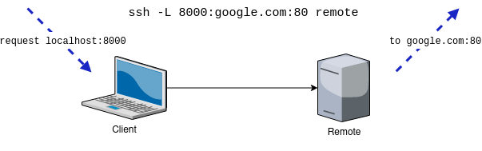
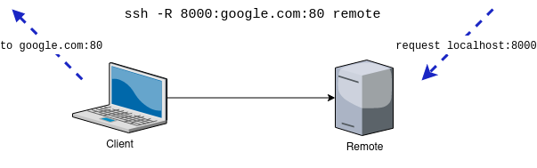
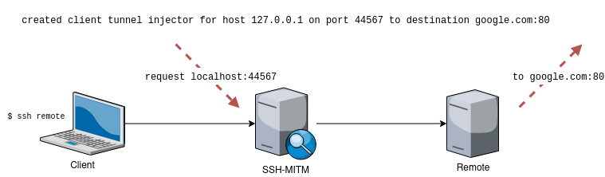
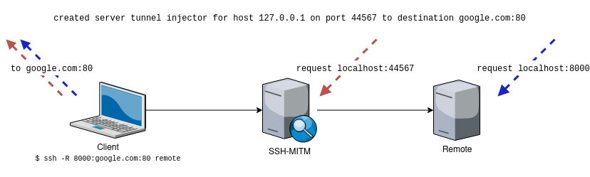

Port Forwarding
===============

Plain SSH (without SSH-MITM) allows remote and local port forwarding over an existing connection.
Port forwarding allows a host to access remote network resources while masquerading as the session endpoint.

- Local port forwarding will allow the client to access network resources over a local port while masquerading as the server.

  ..

- Remote port forwarding will allow the server to access network resources over an open port (on the server) masquerading as the client.

  ..

These standard ssh client port forwarding features are seamlessly implemented so that no further configuration of SSH-MITM is needed.

Proxyjump
----------------

Functionality implemented as part of the *ClientTunnelForwarder*. This variation of a local port forward assumes that the
to-be established connection over the port forward is a ssh connection and therefore uses the master channel
as a direct-tcpip channel to the jumphost (stdin and stdout are connected to the direct-tcpip channel).
The jumphost will therefore not receive a formal shell-session channel request.

Injectable Forwarders
---------------------

When using the *InjectableClientTunnelForwarder* and *InjectableServerTunnelForwarder* plugins of the ssh-mitm server
one is able to use port forwarding of the session to make requests from the mitm server masquerading as the
remote host or the client.

.. code-block:: bash
    :linenos:

    $ ssh-mitm  server--client-tunnel inject --tunnel-client-dest google.com:80 --server-tunnel inject

Using this configuration the ssh-mitm server will open ports on the designated network that will directly
correlate to a port forward request to a given destination.

  ..

  ..

The *InjectableClientTunnelForwarder* can be used **always**, even if the ssh client is not even actively using the port
forwarding feature. Furthermore the ``--tunnel-client-dest`` parameter can receive a space-separated list of destination
targets (e.g. google.com:80). The ssh-mitm server will then open a port for each destination.

The implementation of the *InjectableServerTunnelForwarder* currently only opens one port for injecting into a
remote port forwarding session opened by the client.
