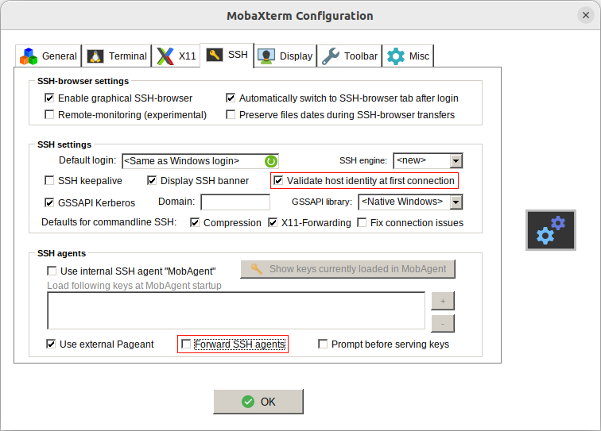

.. _cve-2022-38336:

:bdg-light:`CVSS N/A` CVE-2022-38336
======================================

.. card::

    :bdg-light:`CVSS N/A`
    ^^^
    An access control issue in MobaXterm before v22.2 allows attackers to make connections
    to the server via SSH or SFTP protocols without authentication
    +++
    **Affected Software:**

    * MobaXterm < v22.2

Description
-----------

When using the default configuration, MonaXterm < v22.2, does not properly check for the remote server host key when starting SFTP or SSH sessions.

This can result in man in the middle attacks, because the fingerprint on the first connection attempt is automatically accepted.

.. note::

    Further fingerprint changes result in a warning and the user is informed about a potential man in the middle attack.

Du due an information leak from the PuTTY based ssh client, it's possible for the server to check if the client already knwos the fingerprint or not.
This allows an man in the middle attacker to intercept only new connection and avoid clients wich would show an error about chnaged fingerprints.

The default configuration also forwards the ssh agent, wich allows the man in the middle attacker to abuse the forwarded agent to login to other remote servers.

This vulnerability was discovered by **AUT-milCERT** during an audit of MobaXterm.

Mitigation
----------

The default configuration must be changed.

Go to ``Settings`` and select ``SSH``.

* ``Validate host identity at first connection`` must be checked
* ``Forward SSH agents`` must be disabled

In the screenshot, the changes are highlighted with a red border.

.. note::

    If MobaXterm was updated from a vulnerable version to >=22.2, you must check if the settings are correct!

Release Notes v22.2
-------------------

* **Bugfix:** properly check for the remote server host key when starting SFTP sessions

References
----------

* https://nvd.nist.gov/vuln/detail/CVE-2022-38336
* https://mobaxterm.mobatek.net/download-home-edition.html
